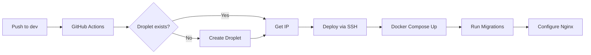
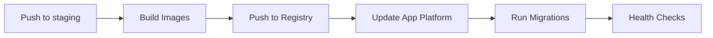
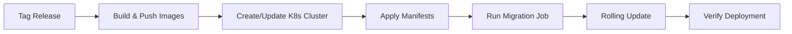

# CI/CD Deployment Guide

## Overview

This template includes automated CI/CD pipelines for three environments, each with different infrastructure approaches optimized for their use case.

## Deployment Strategies by Environment

### 🧪 Development Environment
**Infrastructure**: DigitalOcean Droplet (Auto-provisioned)
**Trigger**: Push to `dev` branch
**Cost**: ~$24/month

#### Features:
- ✅ Automatic droplet creation if not exists
- ✅ Docker Compose deployment
- ✅ Nginx reverse proxy
- ✅ Auto-configured firewall
- ✅ Swap memory for better performance
- ✅ Direct SSH access for debugging

#### Workflow:
```yaml
# .github/workflows/deploy-dev-advanced.yml
on:
  push:
    branches: [dev]
```

### 🎯 Staging Environment
**Infrastructure**: DigitalOcean App Platform
**Trigger**: Push to `staging` branch
**Cost**: ~$50-100/month

#### Features:
- ✅ Fully managed platform
- ✅ Auto-scaling
- ✅ Managed PostgreSQL & Redis
- ✅ Zero-downtime deployments
- ✅ Built-in monitoring
- ✅ Automatic SSL certificates

#### Workflow:
```yaml
# .github/workflows/deploy-staging.yml
on:
  push:
    branches: [staging]
```

### 🚀 Production Environment
**Infrastructure**: DigitalOcean Kubernetes (DOKS)
**Trigger**: Git tags (v*)
**Cost**: ~$150-500/month (scales with usage)

#### Features:
- ✅ Kubernetes orchestration
- ✅ Horizontal auto-scaling (HPA)
- ✅ High availability (multiple replicas)
- ✅ SSL via Let's Encrypt
- ✅ Rate limiting
- ✅ Health checks & auto-recovery
- ✅ Rolling updates
- ✅ Resource limits & requests

#### Workflow:
```yaml
# .github/workflows/deploy-production.yml
on:
  push:
    tags:
      - 'v*'
```

## GitHub Secrets Configuration

You need to configure these secrets in your GitHub repository:

### Common Secrets
```bash
DIGITALOCEAN_ACCESS_TOKEN    # Your DO API token
DO_REGISTRY_NAME             # Container registry name
DO_REGION                    # Region (nyc1, fra1, etc.)
DO_SSH_KEY_FINGERPRINT       # SSH key fingerprint
DO_SSH_PRIVATE_KEY          # Private SSH key
APP_NAME                    # Your application name
DOMAIN_NAME                 # Your domain (for staging/prod)
ADMIN_EMAIL                 # Admin email for Let's Encrypt
GOOGLE_CLIENT_ID            # Google OAuth client ID
GOOGLE_CLIENT_SECRET        # Google OAuth secret
```

### Development Secrets
```bash
DEV_POSTGRES_DB             # Database name
DEV_POSTGRES_USER           # Database user
DEV_POSTGRES_PASSWORD       # Database password
DEV_JWT_SECRET             # JWT secret key
```

### Staging Secrets
```bash
STAGING_JWT_SECRET          # JWT secret for staging
```

### Production Secrets
```bash
PROD_DATABASE_URL          # Full database connection string
PROD_JWT_SECRET            # JWT secret for production
PROD_REDIS_URL             # Redis connection string
```

## Deployment Flow

### Development Workflow


### Staging Workflow


### Production Workflow


## Setting Up Your Repository

### 1. Create DigitalOcean Resources

```bash
# Install doctl
brew install doctl  # macOS
# or
snap install doctl  # Linux

# Authenticate
doctl auth init

# Create container registry
doctl registry create <registry-name>

# Create SSH key
ssh-keygen -t rsa -b 4096 -f ~/.ssh/do_deploy_key
doctl compute ssh-key import deploy-key --public-key-file ~/.ssh/do_deploy_key.pub

# Get the fingerprint
doctl compute ssh-key list
```

### 2. Configure GitHub Environments

1. Go to Settings → Environments
2. Create three environments: `development`, `staging`, `production`
3. For production, add required reviewers
4. Add environment-specific secrets

### 3. Set Up Domain (for staging/production)

```bash
# Point your domain to DigitalOcean nameservers:
# ns1.digitalocean.com
# ns2.digitalocean.com
# ns3.digitalocean.com

# Add domain to DO
doctl compute domain create <your-domain.com>

# The Kubernetes ingress will handle subdomain routing
```

## Deployment Commands

### Manual Deployment Triggers

```bash
# Development (auto-deploys on push to dev)
git push origin dev

# Staging (auto-deploys on push to staging)
git push origin staging

# Production (deploy specific version)
git tag v1.0.0
git push origin v1.0.0

# Or trigger manually from GitHub Actions UI
```

### Rollback Procedures

#### Development
```bash
# SSH into droplet
ssh root@<droplet-ip>

# Rollback using git
cd /app
git log --oneline
git reset --hard <commit-hash>
docker-compose down
docker-compose up -d --build
```

#### Staging
```bash
# Rollback via App Platform
doctl apps list
doctl apps create-deployment <app-id> --rollback
```

#### Production
```bash
# Rollback deployment
kubectl rollout undo deployment/backend -n production
kubectl rollout undo deployment/frontend -n production

# Or to specific revision
kubectl rollout history deployment/backend -n production
kubectl rollout undo deployment/backend --to-revision=2 -n production
```

## Monitoring & Debugging

### Development
```bash
# View logs
ssh root@<droplet-ip>
cd /app
docker-compose logs -f

# Check container status
docker ps
docker-compose ps
```

### Staging
```bash
# View App Platform logs
doctl apps logs <app-id> --follow

# Get app details
doctl apps get <app-id>
```

### Production
```bash
# View pod logs
kubectl logs -f deployment/backend -n production
kubectl logs -f deployment/frontend -n production

# Check pod status
kubectl get pods -n production
kubectl describe pod <pod-name> -n production

# Scale manually if needed
kubectl scale deployment/backend --replicas=5 -n production

# View HPA status
kubectl get hpa -n production
```

## Cost Optimization

### Development
- Use smallest droplet size for dev ($6-24/month)
- Destroy droplet when not in use
- Use snapshots for quick recreation

### Staging
- Use App Platform's sleep feature
- Scale down during off-hours
- Share database between staging environments

### Production
- Use node autoscaling (2-10 nodes)
- Implement pod autoscaling (HPA)
- Use spot instances where possible
- Monitor and optimize resource requests/limits

## Security Best Practices

1. **Secrets Management**
   - Never commit secrets to code
   - Use GitHub Secrets for sensitive data
   - Rotate secrets regularly

2. **Network Security**
   - Development: Firewall configured via ufw
   - Staging: App Platform handles security
   - Production: Network policies in Kubernetes

3. **SSL/TLS**
   - Development: Optional (can add Let's Encrypt)
   - Staging: Automatic via App Platform
   - Production: Automatic via cert-manager

4. **Access Control**
   - Use deployment environments in GitHub
   - Require reviews for production
   - Limit SSH access to development only

## Troubleshooting

### Common Issues

#### Droplet Creation Fails (Dev)
```bash
# Check DO API token
doctl account get

# Check SSH key
doctl compute ssh-key list

# Manually create droplet
doctl compute droplet create <name> --image docker-20-04 --size s-2vcpu-4gb
```

#### App Platform Deploy Fails (Staging)
```bash
# Check build logs
doctl apps logs <app-id> --type=build

# Validate spec
doctl apps spec validate app-spec.yaml
```

#### Kubernetes Deploy Fails (Production)
```bash
# Check cluster status
kubectl cluster-info
kubectl get nodes

# Check events
kubectl get events -n production --sort-by='.lastTimestamp'

# Debug specific pod
kubectl describe pod <pod-name> -n production
kubectl logs <pod-name> -n production --previous
```

## Next Steps

1. **Set up monitoring**
   - Add Datadog or New Relic
   - Configure alerts
   - Set up log aggregation

2. **Add more environments**
   - QA environment
   - Performance testing environment

3. **Enhance security**
   - Add vulnerability scanning
   - Implement SAST/DAST
   - Add container scanning

4. **Optimize performance**
   - Add CDN for frontend
   - Implement caching strategies
   - Database read replicas